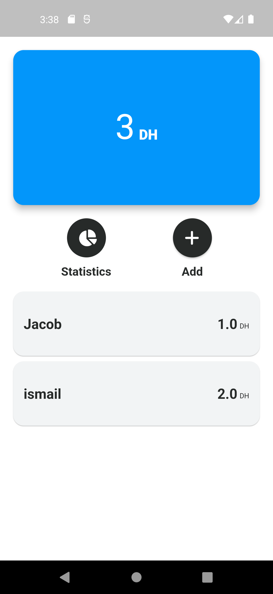
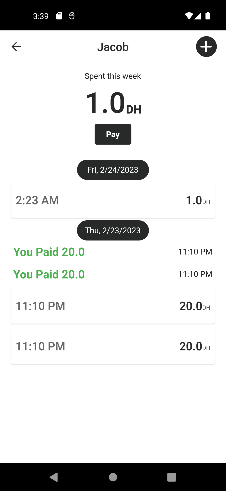

# Credit Manager App

The Credit Manager app is designed to help you keep track of who you owe money to and how much. It uses Moroccan Dirham as its currency, so you can easily manage your debts easily.

You can download the latest release of this app in APK format from the [Releases](https://github.com/yoooby/combien-credit-manager/releases) page. Please note that this app is still in development and may contain bugs.

## Screenshots
<table>
  <tr>
    <td>Home Page</td>
     <td>Store Page</td>
     <td>Add a record</td>
  </tr>
  <tr>
    <td></td>
    <td></td>
    <td></td>
  </tr>
 </table>
 
## Features

- Add and edit credit/debt records
- View all credit/debt records at once
- Calculate total debts and credit per store
- Filter records by store
- Delete records
- multiple languages AR EN FR

## Getting Started

### Prerequisites

- Flutter SDK (version 2.0.6 or later)
- Android Studio or VS Code

### Installation

1. Clone the repository: `git clone https://github.com/your-username/credit-manager-app.git`
2. Open the project in Android Studio or VS Code
3. Run `flutter pub get` to install the dependencies

### Running the app

1. Connect your Android device to your computer or launch an emulator
2. Run the app using `flutter run` command

## Dependencies

- [jiffy](https://pub.dev/packages/jiffy): A Flutter package for formatting and manipulating dates and times.
- [isar](https://pub.dev/packages/isar): A fast, lightweight NoSQL embedded database for Flutter and Dart.
- [Riverpod](https://pub.dev/packages/riverpod): A simple and elegant state management solution for Flutter that emphasizes scalability and performance.
- [rflutter_alert](https://pub.dev/packages/rflutter_alert): A Flutter package for creating beautiful and custom alert dialogs.
- [grouped_list](https://pub.dev/packages/grouped_list): A Flutter package for grouping lists by section.
- [freezed](https://pub.dev/packages/freezed): A code generator for immutable classes that provides copyWith and comparison methods out-of-the-box.

## Contributing

If you find any bugs or want to suggest improvements, feel free to open an issue or submit a pull request.

## Note

This is a learning project and was created to help me gain experience in Flutter. While the app is functional, it may not have all the features or optimizations of a production-ready app. Any feedback or suggestions for improvement are welcome!

## License

This project is licensed under the [GPLv3 License](https://opensource.org/license/gpl-3-0).
