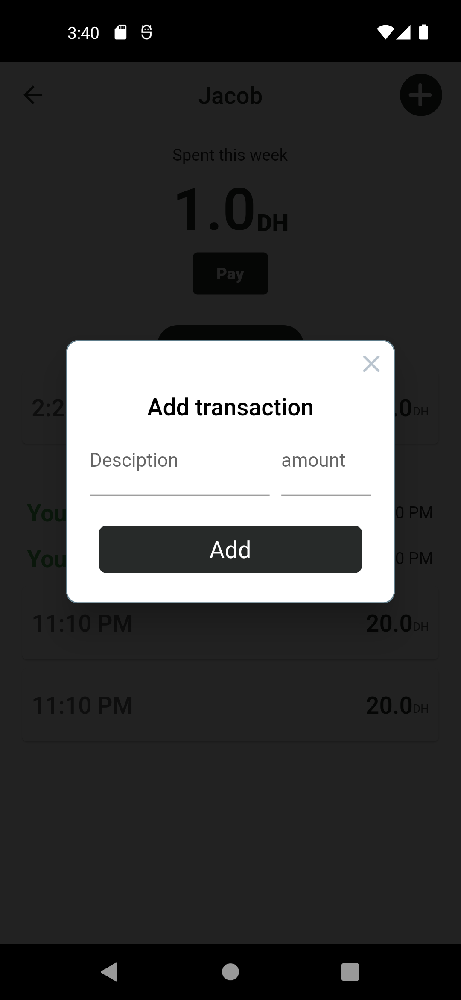

# Credit Manager App

The Credit Manager app is designed to help you keep track of who you owe money to and how much. It uses Moroccan Dirham as its currency, so you can easily manage your debts easily.

## Screenshots
<table>
  <tr>
    <td>Home Page</td>
     <td>Store Page</td>
     <td>Add a record</td>
  </tr>
  <tr>
    <td></td>
    <td></td>
    <td></td>
  </tr>
 </table>
 
## Features

- Add and edit credit/debt records
- View all credit/debt records at once
- Calculate total debts and credit per store
- Filter records by store
- Delete records
- multiple languages AR EN FR

## Getting Started

### Prerequisites

- Flutter SDK (version 2.0.6 or later)
- Android Studio or VS Code

### Installation

1. Clone the repository: `git clone https://github.com/your-username/credit-manager-app.git`
2. Open the project in Android Studio or VS Code
3. Run `flutter pub get` to install the dependencies

### Running the app

1. Connect your Android device to your computer or launch an emulator
2. Run the app using `flutter run` command

## Dependencies

- jiffy
- isar
- Riverpod
- rflutter_alert
- grouped_list
- freezed

## Contributing

If you find any bugs or want to suggest improvements, feel free to open an issue or submit a pull request.

## License

This project is licensed under the [GPLv3 License](https://opensource.org/license/gpl-3-0).
